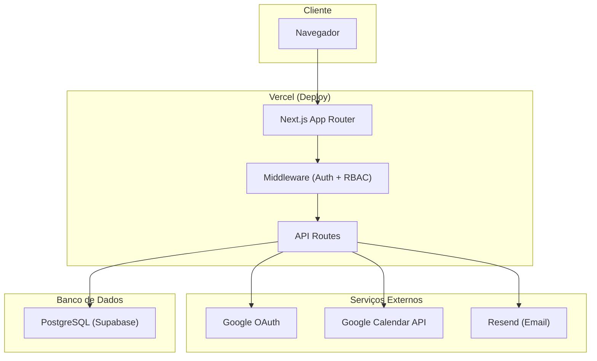
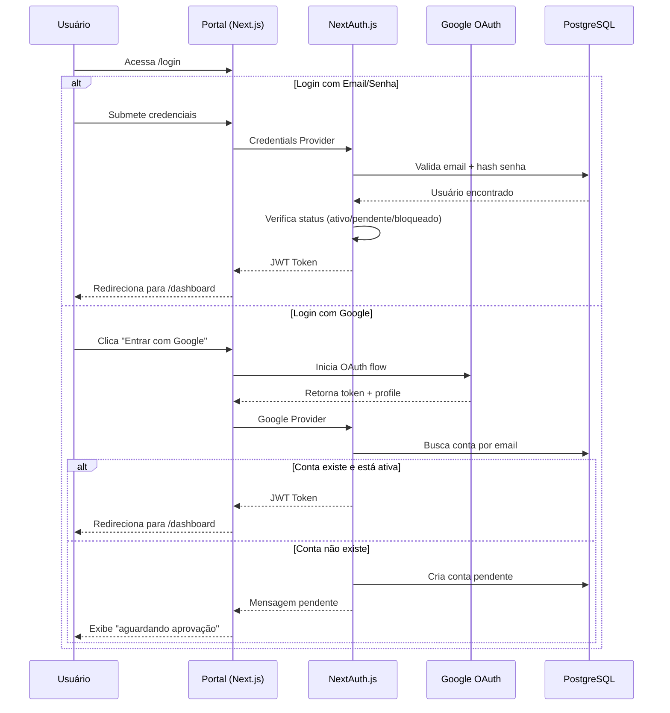
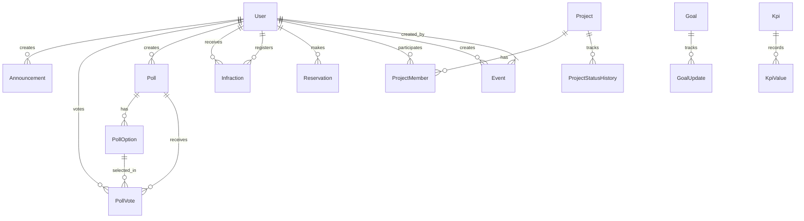

# Design Técnico — Portal Interno EJMC

## Visão Geral

O Portal Interno EJMC é uma aplicação web full-stack que centraliza a gestão da empresa júnior. O sistema atende até 80 usuários simultâneos com 5 níveis de permissão hierárquicos, integrando módulos de dashboard, cronograma (Google Calendar), metas, KPIs, membros, projetos, comunicados, enquetes, pontuação e reserva de computadores.

### Decisões Arquiteturais Principais

| Decisão             | Escolha                         | Justificativa                                                                     |
| ------------------- | ------------------------------- | --------------------------------------------------------------------------------- |
| Frontend            | Next.js 14 (App Router)         | SSR/SSG, roteamento baseado em arquivos, React Server Components para performance |
| Backend             | Next.js API Routes + Prisma ORM | Monorepo simplificado, type-safety end-to-end, deploy unificado                   |
| Banco de Dados      | PostgreSQL (Supabase)           | Relacional robusto, Row Level Security, auth integrado, tier gratuito generoso    |
| Autenticação        | NextAuth.js v5                  | Suporte nativo a Google OAuth + Credentials, sessões JWT                          |
| Estilização         | Tailwind CSS + CSS Variables    | Design system consistente, responsividade nativa, customização via variáveis      |
| Integração Calendar | Google Calendar API v3          | API oficial, webhooks para sync bidirecional                                      |
| Deploy              | Vercel                          | Zero-config para Next.js, edge functions, preview deploys                         |
| Linguagem           | TypeScript                      | Type-safety, melhor DX, menos bugs em runtime                                     |

---

## Arquitetura

### Diagrama de Arquitetura de Alto Nível



### Fluxo de Autenticação



### Estrutura de Pastas

```
portal-ejmc/
├── src/
│   ├── app/                          # App Router (páginas)
│   │   ├── (auth)/                   # Grupo: páginas públicas
│   │   │   ├── login/
│   │   │   ├── cadastro/
│   │   │   └── layout.tsx
│   │   ├── (portal)/                 # Grupo: páginas autenticadas
│   │   │   ├── dashboard/
│   │   │   ├── cronograma/
│   │   │   ├── metas/
│   │   │   ├── kpis/
│   │   │   ├── membros/
│   │   │   ├── perfil/
│   │   │   ├── portfolio/
│   │   │   ├── projetos/
│   │   │   ├── comunicados/
│   │   │   ├── enquetes/
│   │   │   ├── pontuacao/
│   │   │   ├── reservas/
│   │   │   ├── configuracoes/
│   │   │   ├── admin/
│   │   │   └── layout.tsx
│   │   ├── api/                      # API Routes
│   │   │   ├── auth/[...nextauth]/
│   │   │   ├── users/
│   │   │   ├── goals/
│   │   │   ├── kpis/
│   │   │   ├── projects/
│   │   │   ├── announcements/
│   │   │   ├── polls/
│   │   │   ├── calendar/
│   │   │   ├── scores/
│   │   │   ├── reservations/
│   │   │   └── services/
│   │   ├── layout.tsx
│   │   └── globals.css
│   ├── components/
│   │   ├── ui/                       # Componentes base (Button, Input, Card...)
│   │   ├── layout/                   # Navbar, Sidebar, Footer
│   │   ├── forms/                    # Formulários reutilizáveis
│   │   └── modules/                  # Componentes específicos de módulos
│   ├── lib/
│   │   ├── auth.ts                   # Configuração NextAuth
│   │   ├── prisma.ts                 # Cliente Prisma
│   │   ├── google-calendar.ts        # Integração Google Calendar
│   │   ├── email.ts                  # Serviço de email
│   │   ├── validators.ts            # Schemas de validação (Zod)
│   │   └── permissions.ts           # Lógica de permissões RBAC
│   ├── hooks/                        # Custom React hooks
│   ├── types/                        # Tipos TypeScript compartilhados
│   └── utils/                        # Utilitários gerais
├── prisma/
│   ├── schema.prisma                 # Schema do banco
│   └── seed.ts                       # Dados iniciais
├── public/
│   ├── logoejmc.png
│   └── ...
├── tests/
│   ├── unit/
│   ├── integration/
│   └── property/
├── tailwind.config.ts
├── next.config.ts
└── package.json
```

---

## Componentes e Interfaces

### Design System (baseado no login.html existente)

O design system herda a identidade visual já estabelecida:

```css
/* Variáveis CSS do Design System */
:root {
  /* Paleta de cores */
  --red-deep: #150508;
  --red-dark: #3d0a10;
  --red-mid: #7a1220;
  --red-core: #c0182e;
  --red-vivid: #e8203a;
  --red-bright: #ff3d54;
  --cream: #fff8f5;
  --white: #ffffff;

  /* Glassmorphism */
  --glass-bg: rgba(255, 255, 255, 0.06);
  --glass-border: rgba(255, 255, 255, 0.14);
  --glass-blur: blur(32px) saturate(1.4);

  /* Inputs */
  --input-bg: rgba(255, 255, 255, 0.09);
  --input-focus: rgba(255, 255, 255, 0.16);

  /* Sombras */
  --shadow-deep: 0 32px 80px rgba(0, 0, 0, 0.6), 0 8px 24px rgba(0, 0, 0, 0.4);
  --shadow-card: 0 8px 32px rgba(0, 0, 0, 0.2);
  --shadow-sm: 0 2px 8px rgba(0, 0, 0, 0.15);

  /* Tipografia */
  --font-heading: 'Playfair Display', serif;
  --font-body: 'DM Sans', sans-serif;
  --font-mono: 'DM Mono', monospace;

  /* Bordas */
  --radius-sm: 8px;
  --radius-md: 12px;
  --radius-lg: 16px;
  --radius-xl: 24px;

  /* Breakpoints (referência) */
  --bp-mobile: 768px;
  --bp-tablet: 1024px;

  /* Superfícies para modo claro (interior do portal) */
  --surface-bg: #faf8f6;
  --surface-card: #ffffff;
  --surface-sidebar: #1a0a0d;
  --text-primary: #1a0a0d;
  --text-secondary: #5c3a3f;
  --text-muted: #9a7a7f;
  --border-light: #f0e8e5;
}
```

### Componentes UI Principais

```typescript
// Componentes base reutilizáveis
interface ButtonProps {
  variant: 'primary' | 'secondary' | 'ghost' | 'danger';
  size: 'sm' | 'md' | 'lg';
  loading?: boolean;
  disabled?: boolean;
  children: React.ReactNode;
}

interface CardProps {
  variant: 'glass' | 'solid' | 'outlined';
  padding?: 'sm' | 'md' | 'lg';
  children: React.ReactNode;
}

interface InputProps {
  label: string;
  type: 'text' | 'email' | 'password' | 'number' | 'date';
  error?: string;
  icon?: React.ReactNode;
}

interface ModalProps {
  open: boolean;
  onClose: () => void;
  title: string;
  children: React.ReactNode;
}

interface DataTableProps<T> {
  data: T[];
  columns: Column<T>[];
  pagination?: { page: number; pageSize: number; total: number };
  filters?: Filter[];
  onSort?: (column: string, direction: 'asc' | 'desc') => void;
}
```

### Layout Principal (Portal Autenticado)

```typescript
// Layout com sidebar + conteúdo
interface PortalLayoutProps {
  children: React.ReactNode;
}

// Sidebar com itens filtrados por permissão
interface SidebarItem {
  label: string;
  href: string;
  icon: React.ReactNode;
  requiredPermission?: PermissionLevel[];
}

const sidebarItems: SidebarItem[] = [
  { label: 'Dashboard', href: '/dashboard', icon: <HomeIcon /> },
  { label: 'Cronograma', href: '/cronograma', icon: <CalendarIcon /> },
  { label: 'Metas', href: '/metas', icon: <TargetIcon /> },
  { label: 'KPIs', href: '/kpis', icon: <ChartIcon /> },
  { label: 'Membros', href: '/membros', icon: <UsersIcon /> },
  { label: 'Portfólio', href: '/portfolio', icon: <BriefcaseIcon /> },
  { label: 'Projetos', href: '/projetos', icon: <FolderIcon /> },
  { label: 'Comunicados', href: '/comunicados', icon: <MegaphoneIcon /> },
  { label: 'Enquetes', href: '/enquetes', icon: <VoteIcon /> },
  { label: 'Pontuação', href: '/pontuacao', icon: <AlertIcon />, requiredPermission: ['ADMIN', 'DIRETOR', 'GP_MEMBER'] },
  { label: 'Reservas', href: '/reservas', icon: <MonitorIcon /> },
  { label: 'Admin', href: '/admin', icon: <ShieldIcon />, requiredPermission: ['ADMIN'] },
];
```

### API Routes — Interfaces Principais

```typescript
// ─── Autenticação ───
// POST /api/auth/register
interface RegisterRequest {
  name: string; // 3-150 chars
  email: string; // email corporativo válido
  password: string; // min 8 chars, 1 upper, 1 lower, 1 number
}
interface RegisterResponse {
  success: boolean;
  message: string;
}

// ─── Usuários / Admin ───
// GET /api/users?status=pending|active|inactive
// POST /api/users (admin cria conta)
// PATCH /api/users/:id (alterar permissão, aprovar, desativar)
// DELETE /api/users/:id (desativar conta)

// ─── Metas ───
// GET /api/goals?type=general|area&area=vendas|...
// POST /api/goals
interface CreateGoalRequest {
  name: string; // max 100 chars
  description: string; // max 500 chars
  deadline: string; // ISO date (futuro)
  type: 'GENERAL' | 'AREA';
  areaId?: string; // obrigatório se type === 'AREA'
}
// PATCH /api/goals/:id (atualizar progresso)
interface UpdateGoalProgressRequest {
  progress: number; // 0-100 inteiro
}

// ─── KPIs ───
// GET /api/kpis?area=vendas|...
// POST /api/kpis/:id/values
interface CreateKpiValueRequest {
  value: number; // até 2 casas decimais
  date: string; // ISO date
}

// ─── Cronograma / Calendar ───
// GET /api/calendar/events?month=2024-01
// POST /api/calendar/events
interface CreateEventRequest {
  title: string; // max 100 chars
  startDate: string; // ISO datetime
  endDate: string; // ISO datetime
  description?: string;
}
// PATCH /api/calendar/events/:id
// DELETE /api/calendar/events/:id

// ─── Projetos ───
// GET /api/projects?status=em_andamento|concluido|congelado|cancelado
// GET /api/projects/:id
// PATCH /api/projects/:id/status
interface UpdateProjectStatusRequest {
  status: 'EM_ANDAMENTO' | 'CONCLUIDO' | 'CONGELADO' | 'CANCELADO';
}

// ─── Comunicados ───
// GET /api/announcements?page=1&pageSize=20
// POST /api/announcements
interface CreateAnnouncementRequest {
  title: string; // max 150 chars
  content: string; // max 5000 chars
}

// ─── Enquetes ───
// GET /api/polls
// POST /api/polls
interface CreatePollRequest {
  title: string; // max 150 chars
  description: string; // max 2000 chars
  options: string[]; // 2-10 opções, cada max 200 chars
}
// POST /api/polls/:id/vote
interface VoteRequest {
  optionIndex: number;
}
// PATCH /api/polls/:id/close

// ─── Pontuação ───
// GET /api/scores?userId=...&semester=2024-1
// POST /api/scores
interface CreateInfractionRequest {
  type: 'ATRASO' | 'FALTA' | 'DRESS_CODE';
  date: string; // ISO date, <= hoje
  userId: string; // membro infrator
}
// DELETE /api/scores/:id

// ─── Reservas ───
// GET /api/reservations?startDate=...&endDate=...
// POST /api/reservations
interface CreateReservationRequest {
  computerId: number; // 1-7
  date: string; // ISO date, >= amanhã, <= 7 dias
}
// DELETE /api/reservations/:id

// ─── Portfólio ───
// GET /api/services?page=1&pageSize=50
// POST /api/services
// PATCH /api/services/:id
interface ServiceRequest {
  name: string; // 3-100 chars
  description: string; // 10-1000 chars
}
```

### Sistema de Permissões (RBAC)

```typescript
// lib/permissions.ts
enum PermissionLevel {
  ADMIN = 'ADMIN',
  DIRETOR = 'DIRETOR',
  GERENTE = 'GERENTE',
  COORDENADOR = 'COORDENADOR',
  MEMBRO = 'MEMBRO',
}

// Hierarquia: ADMIN > DIRETOR > GERENTE > COORDENADOR > MEMBRO
const PERMISSION_HIERARCHY: Record<PermissionLevel, number> = {
  ADMIN: 5,
  DIRETOR: 4,
  GERENTE: 3,
  COORDENADOR: 2,
  MEMBRO: 1,
};

interface PermissionRule {
  action: string;
  minLevel: PermissionLevel;
  customCheck?: (user: User) => boolean;
}

// Matriz de permissões
const PERMISSION_MATRIX: PermissionRule[] = [
  // Admin
  { action: 'admin.access', minLevel: PermissionLevel.ADMIN },
  { action: 'users.manage', minLevel: PermissionLevel.ADMIN },
  { action: 'projects.changeStatus', minLevel: PermissionLevel.ADMIN },

  // Diretor+
  { action: 'goals.create', minLevel: PermissionLevel.DIRETOR },
  { action: 'goals.updateProgress', minLevel: PermissionLevel.DIRETOR },
  { action: 'services.manage', minLevel: PermissionLevel.DIRETOR },
  { action: 'polls.create', minLevel: PermissionLevel.GERENTE },

  // Coordenador+
  { action: 'events.manage', minLevel: PermissionLevel.COORDENADOR },
  { action: 'announcements.create', minLevel: PermissionLevel.COORDENADOR },

  // Pontuação: GP + Diretor
  {
    action: 'scores.view_all',
    minLevel: PermissionLevel.DIRETOR,
    customCheck: (user) => user.area === 'GESTAO_PESSOAS' || PERMISSION_HIERARCHY[user.role] >= 4,
  },
  {
    action: 'scores.create',
    minLevel: PermissionLevel.MEMBRO,
    customCheck: (user) => user.area === 'GESTAO_PESSOAS',
  },

  // Todos
  { action: 'reservations.manage', minLevel: PermissionLevel.MEMBRO },
];

function hasPermission(user: User, action: string): boolean {
  const rule = PERMISSION_MATRIX.find((r) => r.action === action);
  if (!rule) return false;
  if (PERMISSION_HIERARCHY[user.role] < PERMISSION_HIERARCHY[rule.minLevel]) return false;
  if (rule.customCheck && !rule.customCheck(user)) return false;
  return true;
}
```

---

## Modelos de Dados

### Schema Prisma

```prisma
generator client {
  provider = "prisma-client-js"
}

datasource db {
  provider = "postgresql"
  url      = env("DATABASE_URL")
}

// ─── Enums ───

enum UserRole {
  ADMIN
  DIRETOR
  GERENTE
  COORDENADOR
  MEMBRO
}

enum AccountStatus {
  PENDING
  ACTIVE
  INACTIVE
  REJECTED
}

enum Area {
  VENDAS
  PRESIDENCIA
  PROJETOS
  MARKETING
  GESTAO_PESSOAS
  ADM_FIN
}

enum ProjectStatus {
  EM_ANDAMENTO
  CONCLUIDO
  CONGELADO
  CANCELADO
}

enum InfractionType {
  ATRASO
  FALTA
  DRESS_CODE
}

enum PollStatus {
  ACTIVE
  CLOSED
}

enum GoalType {
  GENERAL
  AREA
}

enum KpiUnit {
  PERCENTAGE
  INTEGER
  DECIMAL
}

// ─── Modelos ───

model User {
  id             String        @id @default(cuid())
  name           String        @db.VarChar(150)
  email          String        @unique @db.VarChar(255)
  passwordHash   String?       // null se login apenas via Google
  role           UserRole      @default(MEMBRO)
  status         AccountStatus @default(PENDING)
  area           Area?
  position       String?       @db.VarChar(100)  // cargo
  phone          String?       @db.VarChar(15)
  cpf            String?       @db.VarChar(11)
  avatarUrl      String?
  googleId       String?       @unique
  failedAttempts Int           @default(0)
  lockedUntil    DateTime?
  lastActivity   DateTime?
  createdAt      DateTime      @default(now())
  updatedAt      DateTime      @updatedAt

  // Relações
  announcements  Announcement[]
  pollVotes      PollVote[]
  pollsCreated   Poll[]
  infractions    Infraction[]   @relation("InfractionTarget")
  infractionsBy  Infraction[]   @relation("InfractionCreator")
  reservations   Reservation[]
  projectMembers ProjectMember[]
  goalUpdates    GoalUpdate[]
  kpiValues      KpiValue[]
  eventCreator   Event[]

  @@index([email])
  @@index([status])
  @@index([area])
}

model Event {
  id          String   @id @default(cuid())
  title       String   @db.VarChar(100)
  description String?  @db.Text
  startDate   DateTime
  endDate     DateTime
  googleEventId String? @unique
  createdById String
  createdBy   User     @relation(fields: [createdById], references: [id])
  createdAt   DateTime @default(now())
  updatedAt   DateTime @updatedAt
  syncStatus  String   @default("synced") // synced, pending, failed
  syncRetries Int      @default(0)

  @@index([startDate, endDate])
}

model Goal {
  id          String     @id @default(cuid())
  name        String     @db.VarChar(100)
  description String     @db.VarChar(500)
  deadline    DateTime
  progress    Int        @default(0) // 0-100
  type        GoalType
  area        Area?
  createdAt   DateTime   @default(now())
  updatedAt   DateTime   @updatedAt

  updates     GoalUpdate[]

  @@index([type, area])
  @@index([deadline])
}

model GoalUpdate {
  id        String   @id @default(cuid())
  goalId    String
  goal      Goal     @relation(fields: [goalId], references: [id], onDelete: Cascade)
  progress  Int      // valor do progresso naquele momento
  updatedBy String
  user      User     @relation(fields: [updatedBy], references: [id])
  createdAt DateTime @default(now())
}

model Kpi {
  id     String  @id @default(cuid())
  name   String  @db.VarChar(60)
  unit   KpiUnit
  area   Area
  isDefault Boolean @default(false)
  createdAt DateTime @default(now())

  values KpiValue[]

  @@unique([name, area])
  @@index([area])
}

model KpiValue {
  id        String   @id @default(cuid())
  kpiId     String
  kpi       Kpi      @relation(fields: [kpiId], references: [id], onDelete: Cascade)
  value     Decimal  @db.Decimal(12, 2)
  date      DateTime
  createdBy String
  user      User     @relation(fields: [createdBy], references: [id])
  createdAt DateTime @default(now())

  @@index([kpiId, date])
}

model Project {
  id          String        @id @default(cuid())
  name        String        @db.VarChar(200)
  description String?       @db.VarChar(2000)
  status      ProjectStatus @default(EM_ANDAMENTO)
  createdAt   DateTime      @default(now())
  updatedAt   DateTime      @updatedAt

  members     ProjectMember[]
  statusHistory ProjectStatusHistory[]

  @@index([status])
}

model ProjectMember {
  id        String  @id @default(cuid())
  projectId String
  project   Project @relation(fields: [projectId], references: [id], onDelete: Cascade)
  userId    String
  user      User    @relation(fields: [userId], references: [id])

  @@unique([projectId, userId])
}

model ProjectStatusHistory {
  id          String        @id @default(cuid())
  projectId   String
  project     Project       @relation(fields: [projectId], references: [id], onDelete: Cascade)
  oldStatus   ProjectStatus
  newStatus   ProjectStatus
  changedBy   String        // nome do usuário
  changedAt   DateTime      @default(now())
}

model Announcement {
  id        String   @id @default(cuid())
  title     String   @db.VarChar(150)
  content   String   @db.VarChar(5000)
  authorId  String
  author    User     @relation(fields: [authorId], references: [id])
  createdAt DateTime @default(now())

  @@index([createdAt])
}

model Poll {
  id          String     @id @default(cuid())
  title       String     @db.VarChar(150)
  description String     @db.VarChar(2000)
  status      PollStatus @default(ACTIVE)
  createdById String
  createdBy   User       @relation(fields: [createdById], references: [id])
  createdAt   DateTime   @default(now())
  closedAt    DateTime?

  options     PollOption[]
  votes       PollVote[]
}

model PollOption {
  id     String @id @default(cuid())
  pollId String
  poll   Poll   @relation(fields: [pollId], references: [id], onDelete: Cascade)
  text   String @db.VarChar(200)
  order  Int

  votes  PollVote[]
}

model PollVote {
  id       String     @id @default(cuid())
  pollId   String
  poll     Poll       @relation(fields: [pollId], references: [id], onDelete: Cascade)
  optionId String
  option   PollOption @relation(fields: [optionId], references: [id])
  userId   String
  user     User       @relation(fields: [userId], references: [id])
  votedAt  DateTime   @default(now())

  @@unique([pollId, userId]) // um voto por enquete
}

model Infraction {
  id          String         @id @default(cuid())
  type        InfractionType
  date        DateTime
  points      Int
  targetId    String
  target      User           @relation("InfractionTarget", fields: [targetId], references: [id])
  createdById String
  createdBy   User           @relation("InfractionCreator", fields: [createdById], references: [id])
  createdAt   DateTime       @default(now())

  @@index([targetId, date])
  @@index([targetId, createdAt])
}

model Reservation {
  id         String   @id @default(cuid())
  computerId Int      // 1-7
  date       DateTime @db.Date
  userId     String
  user       User     @relation(fields: [userId], references: [id])
  createdAt  DateTime @default(now())

  @@unique([computerId, date]) // um usuário por computador por dia
  @@index([userId, date])
  @@index([date])
}

model Service {
  id          String   @id @default(cuid())
  name        String   @db.VarChar(100)
  description String   @db.VarChar(1000)
  createdAt   DateTime @default(now())
  updatedAt   DateTime @updatedAt

  @@index([name])
}

model InfractionConfig {
  id     String         @id @default(cuid())
  type   InfractionType @unique
  points Int
}
```

### Diagrama ER Simplificado



---

## Propriedades de Corretude

_Uma propriedade é uma característica ou comportamento que deve ser verdadeiro em todas as execuções válidas de um sistema — essencialmente, uma declaração formal sobre o que o sistema deve fazer. Propriedades servem como ponte entre especificações legíveis por humanos e garantias de corretude verificáveis por máquina._

### Propriedade 1: Erro genérico para credenciais inválidas

_Para qualquer_ combinação de email e senha onde o email não existe no sistema OU a senha não corresponde ao hash armazenado, o sistema SHALL retornar exatamente a mesma mensagem de erro genérica, sem revelar qual campo está incorreto.

**Valida: Requisitos 1.2**

### Propriedade 2: Lógica de bloqueio por tentativas

_Para qualquer_ sequência de tentativas de login para um mesmo email, o sistema SHALL bloquear o email se e somente se houver 5 ou mais tentativas consecutivas com falha dentro de uma janela de 15 minutos. Tentativas após o bloqueio devem ser rejeitadas até que os 15 minutos de bloqueio expirem.

**Valida: Requisitos 1.4**

### Propriedade 3: Contas não-ativas são negadas no login

_Para qualquer_ conta com status diferente de ACTIVE (PENDING, INACTIVE, REJECTED), independentemente de as credenciais estarem corretas, o sistema SHALL negar a autenticação e retornar mensagem indicando que a conta não está ativa.

**Valida: Requisitos 1.5, 3.3**

### Propriedade 4: Validação de dados de cadastro

_Para qualquer_ conjunto de dados de registro, o sistema SHALL aceitar o cadastro se e somente se: o nome tem entre 3 e 150 caracteres, o email possui formato válido, e a senha tem no mínimo 8 caracteres contendo ao menos uma letra maiúscula, uma minúscula e um número. Dados que violam qualquer regra devem ser rejeitados com mensagens específicas por campo.

**Valida: Requisitos 3.1, 3.6**

### Propriedade 5: Unicidade de email

_Para qualquer_ tentativa de criação de conta (seja por auto-cadastro ou por administrador), se o email já está associado a uma conta existente no sistema, a operação SHALL ser rejeitada.

**Valida: Requisitos 3.2, 4.4**

### Propriedade 6: Proteção do último administrador

_Para qualquer_ estado do sistema onde existe exatamente um usuário com papel ADMIN, qualquer operação que resultaria na remoção, desativação ou rebaixamento desse usuário SHALL ser rejeitada.

**Valida: Requisitos 4.7**

### Propriedade 7: Matriz de permissões RBAC

_Para qualquer_ usuário com um dado papel (ADMIN, DIRETOR, GERENTE, COORDENADOR, MEMBRO) e qualquer ação no sistema, a função `hasPermission` SHALL retornar `true` se e somente se o nível hierárquico do usuário é maior ou igual ao nível mínimo exigido pela ação E quaisquer verificações customizadas (como pertencer à equipe de Gestão de Pessoas para pontuação) são satisfeitas.

**Valida: Requisitos 5.1, 5.2, 8.6, 16.5, 18.3, 18.4**

### Propriedade 8: Visibilidade do menu corresponde às permissões

_Para qualquer_ usuário com um dado papel, os itens visíveis no menu de navegação SHALL ser exatamente aqueles para os quais o usuário possui o nível de permissão requerido — nem mais, nem menos.

**Valida: Requisitos 5.3**

### Propriedade 9: Visibilidade de metas por área

_Para qualquer_ usuário com uma área atribuída, as metas visíveis SHALL incluir todas as metas gerais (type=GENERAL) E todas as metas da sua área específica. Metas de outras áreas NÃO devem ser visíveis, exceto para usuários com papel DIRETOR ou ADMIN que podem ver todas.

**Valida: Requisitos 9.4, 9.7**

### Propriedade 10: Indicador de meta vencida

_Para qualquer_ meta no sistema, o indicador de "vencida" SHALL ser exibido se e somente se a data atual é posterior ao prazo (deadline) E o progresso é inferior a 100%.

**Valida: Requisitos 9.5**

### Propriedade 11: Validação de metas e progresso

_Para qualquer_ operação de criação ou atualização de meta, o sistema SHALL aceitar se e somente se: o nome não é vazio (max 100 chars), a descrição não é vazia (max 500 chars), o prazo é uma data futura, e o progresso é um inteiro entre 0 e 100 (inclusive).

**Valida: Requisitos 9.1, 9.3, 9.6**

### Propriedade 12: Validação de CPF

_Para qualquer_ string de 11 dígitos, o validador de CPF SHALL aceitar se e somente se os dois dígitos verificadores são matematicamente corretos conforme o algoritmo oficial (módulo 11). Strings com todos os dígitos iguais (ex: 111.111.111-11) devem ser rejeitadas.

**Valida: Requisitos 12.3**

### Propriedade 13: Ordenação e filtragem de membros

_Para qualquer_ lista de membros ativos retornada pelo sistema, os membros SHALL estar ordenados alfabeticamente por nome. Quando um filtro de área é aplicado, todos os membros retornados SHALL pertencer à área selecionada, e nenhum membro ativo daquela área deve estar ausente do resultado.

**Valida: Requisitos 11.1, 11.2**

### Propriedade 14: Unicidade de voto em enquete

_Para qualquer_ usuário que já registrou um voto em uma enquete específica, qualquer tentativa subsequente de votar na mesma enquete SHALL ser rejeitada.

**Valida: Requisitos 16.4**

### Propriedade 15: Enquete encerrada rejeita votos

_Para qualquer_ enquete com status CLOSED, qualquer tentativa de voto SHALL ser rejeitada, independentemente de o usuário já ter votado ou não.

**Valida: Requisitos 16.6**

### Propriedade 16: Cálculo de pontuação acumulada

_Para qualquer_ conjunto de infrações registradas para um usuário dentro do semestre vigente, a pontuação acumulada SHALL ser igual à soma dos pontos de todas as infrações ativas (não excluídas). Após a remoção de qualquer infração, a pontuação SHALL ser recalculada como a soma das infrações restantes.

**Valida: Requisitos 18.2, 18.7**

### Propriedade 17: Regras de validação de reserva de computadores

_Para qualquer_ solicitação de reserva, o sistema SHALL aceitar se e somente se TODAS as seguintes condições são verdadeiras:

1. A data é estritamente futura (> hoje) e dentro dos próximos 7 dias
2. O usuário não possui outra reserva para o mesmo dia
3. A nova reserva não formaria uma sequência de 3 ou mais dias consecutivos com reservas do mesmo usuário
4. O computador selecionado (1-7) não está reservado por outro usuário naquele dia

Após o cancelamento de uma reserva futura, o slot SHALL estar disponível para outros usuários.

**Valida: Requisitos 19.2, 19.3, 19.4, 19.5, 19.6, 19.7**

---

## Tratamento de Erros

### Estratégia Geral

| Camada                 | Estratégia                                                   | Exemplo                                                    |
| ---------------------- | ------------------------------------------------------------ | ---------------------------------------------------------- |
| Frontend (formulários) | Validação client-side com Zod + React Hook Form              | Campos destacados em vermelho com mensagem específica      |
| API Routes             | Validação server-side com Zod, retorno de erros estruturados | `{ error: true, code: 'VALIDATION_ERROR', fields: [...] }` |
| Middleware Auth        | Redirecionamento para /login se sessão inválida              | HTTP 401 → redirect                                        |
| Middleware RBAC        | Resposta 403 com mensagem genérica                           | `{ error: true, code: 'FORBIDDEN' }`                       |
| Banco de Dados         | Try/catch com logging, mensagem genérica ao usuário          | Log detalhado no servidor, mensagem amigável no cliente    |
| Google Calendar        | Retry com backoff (3 tentativas, 60s intervalo)              | Dados preservados localmente, sync posterior               |
| Email (Resend)         | Fire-and-forget com retry em background                      | Fila de emails com até 3 tentativas                        |

### Formato de Resposta de Erro da API

```typescript
interface ApiErrorResponse {
  error: true;
  code: ErrorCode;
  message: string; // mensagem amigável para o usuário
  fields?: FieldError[]; // erros de validação por campo
}

interface FieldError {
  field: string;
  message: string;
}

type ErrorCode =
  | 'VALIDATION_ERROR' // dados inválidos
  | 'UNAUTHORIZED' // não autenticado
  | 'FORBIDDEN' // sem permissão
  | 'NOT_FOUND' // recurso não encontrado
  | 'CONFLICT' // conflito (ex: email duplicado)
  | 'RATE_LIMITED' // bloqueio por tentativas
  | 'ACCOUNT_INACTIVE' // conta pendente/desativada
  | 'SYNC_FAILED' // falha na sincronização externa
  | 'INTERNAL_ERROR'; // erro interno do servidor
```

### Tratamento Específico por Módulo

- **Autenticação**: Mensagens genéricas para credenciais inválidas (não revelar se email existe). Rate limiting com bloqueio de 15 min após 5 falhas.
- **Google Calendar**: Retry automático (3x, intervalo 60s). Dados salvos localmente com flag `syncStatus: 'pending'`. UI mostra indicador de sincronização pendente.
- **Reservas**: Validação atômica — todas as regras verificadas antes de confirmar. Conflitos de concorrência tratados com constraint unique no banco.
- **Upload de Avatar**: Validação de tipo MIME e tamanho antes do upload. Limite de 5MB com mensagem clara.

---

## Estratégia de Testes

### Abordagem Dual

O projeto utiliza uma combinação de testes unitários (exemplos específicos) e testes baseados em propriedades (verificação universal):

- **Testes unitários**: Cenários específicos, edge cases, integrações
- **Testes de propriedade**: Propriedades universais que devem valer para todas as entradas válidas

### Stack de Testes

| Ferramenta                | Propósito                                     |
| ------------------------- | --------------------------------------------- |
| Vitest                    | Test runner principal (unit + integration)    |
| fast-check                | Property-based testing                        |
| Testing Library           | Testes de componentes React                   |
| MSW (Mock Service Worker) | Mock de APIs externas                         |
| Playwright                | Testes E2E (responsividade, fluxos completos) |

### Configuração de Testes de Propriedade

- **Biblioteca**: `fast-check` (TypeScript-native, excelente integração com Vitest)
- **Iterações mínimas**: 100 por propriedade
- **Tag format**: `Feature: portal-interno-ejmc, Property {number}: {título}`

### Mapeamento Propriedades → Testes

| Propriedade                  | Arquivo de Teste                               | Gerador Principal                                          |
| ---------------------------- | ---------------------------------------------- | ---------------------------------------------------------- |
| 1: Erro genérico             | `tests/property/auth.property.test.ts`         | Arbitrary email + password                                 |
| 2: Bloqueio por tentativas   | `tests/property/auth.property.test.ts`         | Arbitrary attempt sequences with timestamps                |
| 3: Contas não-ativas         | `tests/property/auth.property.test.ts`         | Arbitrary user with status ∈ {PENDING, INACTIVE, REJECTED} |
| 4: Validação de cadastro     | `tests/property/registration.property.test.ts` | Arbitrary strings for name, email, password                |
| 5: Unicidade de email        | `tests/property/registration.property.test.ts` | Arbitrary emails + existing email set                      |
| 6: Último admin              | `tests/property/admin.property.test.ts`        | Arbitrary admin operations on single-admin state           |
| 7: Matriz RBAC               | `tests/property/permissions.property.test.ts`  | Arbitrary (role, action) pairs                             |
| 8: Menu visibility           | `tests/property/permissions.property.test.ts`  | Arbitrary roles → expected menu items                      |
| 9: Visibilidade metas        | `tests/property/goals.property.test.ts`        | Arbitrary (user.area, goals[])                             |
| 10: Meta vencida             | `tests/property/goals.property.test.ts`        | Arbitrary (deadline, progress, currentDate)                |
| 11: Validação metas          | `tests/property/goals.property.test.ts`        | Arbitrary goal data                                        |
| 12: Validação CPF            | `tests/property/validators.property.test.ts`   | Arbitrary 11-digit strings                                 |
| 13: Membros ordenação/filtro | `tests/property/members.property.test.ts`      | Arbitrary member lists with areas                          |
| 14: Unicidade voto           | `tests/property/polls.property.test.ts`        | Arbitrary (user, poll, existing votes)                     |
| 15: Enquete fechada          | `tests/property/polls.property.test.ts`        | Arbitrary (poll with status CLOSED, vote attempt)          |
| 16: Pontuação acumulada      | `tests/property/scores.property.test.ts`       | Arbitrary infraction sets with points                      |
| 17: Reservas                 | `tests/property/reservations.property.test.ts` | Arbitrary (existing reservations, new request)             |

### Testes Unitários (Exemplos)

- Fluxo completo de login com credenciais válidas
- Fluxo OAuth com Google (mock)
- Aprovação/rejeição de conta por admin
- CRUD de projetos, comunicados, enquetes, serviços
- Dashboard com dados vazios (edge case)
- Retry de sincronização Google Calendar (mock)

### Testes de Integração

- Sessão expira após 8h de inatividade
- Sincronização bidirecional com Google Calendar (mock)
- Propagação de mudança de permissão em tempo real
- Envio de email de notificação (mock Resend)

### Testes E2E (Playwright)

- Fluxo completo: cadastro → aprovação → login → navegação
- Responsividade em 3 breakpoints (320px, 768px, 1440px)
- Menu toggle em mobile
- Reserva de computador com validação de regras

### Exemplo de Teste de Propriedade

```typescript
// tests/property/reservations.property.test.ts
import { fc } from '@fast-check/vitest';
import { describe, it, expect } from 'vitest';
import { validateReservation } from '@/lib/validators';

describe('Feature: portal-interno-ejmc, Property 17: Regras de validação de reserva', () => {
  it.prop(
    [fc.date(), fc.integer({ min: 1, max: 7 }), fc.array(fc.record({
      date: fc.date(),
      computerId: fc.integer({ min: 1, max: 7 }),
      userId: fc.string()
    }))],
    { numRuns: 100 }
  )('reserva aceita sse todas as regras são satisfeitas', (requestDate, computerId, existingReservations) => {
    const today = new Date();
    const userId = 'test-user';
    const result = validateReservation({
      date: requestDate,
      computerId,
      userId,
      existingReservations
    });

    const isFuture = requestDate > today;
    const isWithin7Days = /* ... */;
    const noSameDayDuplicate = /* ... */;
    const noConsecutive3 = /* ... */;
    const computerAvailable = /* ... */;

    const shouldBeValid = isFuture && isWithin7Days && noSameDayDuplicate && noConsecutive3 && computerAvailable;
    expect(result.valid).toBe(shouldBeValid);
  });
});
```
