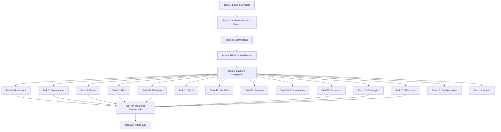

# Implementation Plan: Portal Interno EJMC

## Overview

Plano de implementação do Portal Interno EJMC — plataforma web full-stack para gestão da empresa júnior com Next.js 14, Prisma, NextAuth.js e Tailwind CSS. Cobre setup, banco de dados, autenticação, RBAC, 14 módulos funcionais, testes de propriedade e testes E2E.

## Task Dependency Graph

```json
{
  "waves": [
    { "wave": 1, "tasks": ["1"] },
    { "wave": 2, "tasks": ["2"] },
    { "wave": 3, "tasks": ["3"] },
    { "wave": 4, "tasks": ["4"] },
    { "wave": 5, "tasks": ["5"] },
    {
      "wave": 6,
      "tasks": ["6", "7", "8", "9", "10", "11", "12", "13", "14", "15", "16", "17", "18", "19"]
    },
    { "wave": 7, "tasks": ["20"] },
    { "wave": 8, "tasks": ["21"] }
  ]
}
```



## Tasks

- [x] 1. Setup do Projeto e Infraestrutura
  - [x] 1.1 Inicializar projeto Next.js 14 com App Router e TypeScript (`npx create-next-app@latest`)
  - [x] 1.2 Configurar Tailwind CSS com as variáveis CSS do design system (paleta vermelha, tipografia Playfair/DM Sans, glassmorphism)
  - [x] 1.3 Instalar dependências: `prisma`, `@prisma/client`, `next-auth@beta`, `zod`, `bcryptjs`, `resend`
  - [x] 1.4 Instalar dependências de dev: `vitest`, `@fast-check/vitest`, `@testing-library/react`, `playwright`
  - [x] 1.5 Configurar `tailwind.config.ts` com cores customizadas, fontes e breakpoints (320px, 768px, 1024px)
  - [x] 1.6 Criar `globals.css` com variáveis CSS do design system baseado no login.html existente
  - [x] 1.7 Configurar `vitest.config.ts` e `playwright.config.ts`
  - [x] 1.8 Configurar ESLint e Prettier
  - [x] 1.9 Criar estrutura de pastas conforme design (`src/app`, `src/components`, `src/lib`, `src/hooks`, `src/types`, `tests/`)
  - [x] 1.10 Configurar variáveis de ambiente (`.env.local.example`) com placeholders para DATABASE_URL, NEXTAUTH_SECRET, GOOGLE_CLIENT_ID, GOOGLE_CLIENT_SECRET, RESEND_API_KEY

- [x] 2. Schema Prisma e Banco de Dados
  - [x] 2.1 Criar `prisma/schema.prisma` com todos os enums (UserRole, AccountStatus, Area, ProjectStatus, InfractionType, PollStatus, GoalType, KpiUnit)
  - [x] 2.2 Criar modelo `User` com todos os campos, relações e índices
  - [x] 2.3 Criar modelos `Event`, `Goal`, `GoalUpdate`
  - [x] 2.4 Criar modelos `Kpi`, `KpiValue`
  - [x] 2.5 Criar modelos `Project`, `ProjectMember`, `ProjectStatusHistory`
  - [x] 2.6 Criar modelos `Announcement`, `Poll`, `PollOption`, `PollVote`
  - [x] 2.7 Criar modelos `Infraction`, `InfractionConfig`
  - [x] 2.8 Criar modelos `Reservation`, `Service`
  - [x] 2.9 Criar `prisma/seed.ts` com dados iniciais (admin padrão, KPIs pré-definidos, configuração de infrações, 7 computadores)
  - [x] 2.10 Criar `src/lib/prisma.ts` (singleton do Prisma Client)
  - [x] 2.11 Executar `prisma generate` e validar schema

- [x] 3. Sistema de Autenticação
  - [x] 3.1 Configurar NextAuth.js v5 em `src/lib/auth.ts` com Credentials Provider e Google Provider
  - [x] 3.2 Implementar lógica de login por email/senha com validação de status da conta (ACTIVE, PENDING, INACTIVE)
  - [x] 3.3 Implementar rate limiting: bloqueio após 5 tentativas em 15 minutos (campos `failedAttempts`, `lockedUntil`)
  - [x] 3.4 Implementar sessão JWT com expiração de 8 horas de inatividade
  - [x] 3.5 Implementar fluxo Google OAuth: conta existente → login; conta nova → criar pendente
  - [x] 3.6 Criar API Route `POST /api/auth/register` com validação Zod (nome 3-150, email válido, senha 8+ com maiúscula/minúscula/número)
  - [x] 3.7 Implementar verificação de email duplicado no registro
  - [x] 3.8 Criar página `/login` integrando o HTML existente (login.html) como componente React com Tailwind
  - [x] 3.9 Criar página `/cadastro` com formulário de auto-registro seguindo o design system
  - [x] 3.10 Configurar serviço de email (Resend) para notificações de aprovação/rejeição
  - [x] 3.11 Implementar mensagem de erro genérica (não revelar se email existe)

- [x] 4. RBAC e Middleware de Permissões
  - [x] 4.1 Criar `src/lib/permissions.ts` com enum PermissionLevel, hierarquia e matriz de permissões
  - [x] 4.2 Implementar função `hasPermission(user, action)` com suporte a verificações customizadas (ex: equipe GP)
  - [x] 4.3 Criar middleware Next.js (`src/middleware.ts`) para proteção de rotas autenticadas
  - [x] 4.4 Implementar verificação de permissão nas API Routes (decorator/wrapper)
  - [x] 4.5 Criar hook `usePermission()` para verificação client-side
  - [x] 4.6 Implementar redirecionamento para /login quando sessão expira
  - [x] 4.7 Implementar página 403 (acesso restrito) com mensagem genérica

- [x] 5. Layout Principal e Navegação
  - [x] 5.1 Criar componente `Sidebar` com itens filtrados por permissão do usuário
  - [x] 5.2 Criar layout `(portal)/layout.tsx` com sidebar + área de conteúdo
  - [x] 5.3 Implementar menu responsivo: sidebar visível em desktop/tablet, hamburger em mobile (<768px)
  - [x] 5.4 Implementar toggle do menu mobile com animação
  - [x] 5.5 Implementar indicador visual do item ativo no menu
  - [x] 5.6 Criar componentes UI base: `Button`, `Card`, `Input`, `Modal`, `DataTable`, `Badge`, `Pagination`
  - [x] 5.7 Criar layout `(auth)/layout.tsx` para páginas públicas (login, cadastro) com background de blobs animados
  - [x] 5.8 Implementar breakpoints responsivos (320px min, 768px, 1024px) em todos os componentes base

- [x] 6. Módulo Dashboard
  - [x] 6.1 Criar API Route `GET /api/dashboard` que retorna: membros ativos, projetos em andamento, projetos congelados, faturamento mensal, meta de faturamento, leads do mês
  - [x] 6.2 Criar API Route `GET /api/dashboard/activities` que retorna até 10 atividades do mês corrente ordenadas cronologicamente
  - [x] 6.3 Criar página `/dashboard` com cards de indicadores (KPI cards)
  - [x] 6.4 Implementar componente de lista de atividades do mês
  - [x] 6.5 Implementar fallback: valor zero para indicadores indisponíveis, lista vazia para atividades
  - [x] 6.6 Implementar layout responsivo do dashboard (grid adaptável)

- [x] 7. Módulo Cronograma (Google Calendar)
  - [x] 7.1 Criar `src/lib/google-calendar.ts` com integração Google Calendar API v3 (criar, editar, excluir, listar eventos)
  - [x] 7.2 Criar API Routes: `GET /api/calendar/events`, `POST /api/calendar/events`, `PATCH /api/calendar/events/:id`, `DELETE /api/calendar/events/:id`
  - [x] 7.3 Implementar sincronização bidirecional com retry (3 tentativas, intervalo 60s)
  - [x] 7.4 Implementar campo `syncStatus` (synced, pending, failed) e lógica de retry automático
  - [x] 7.5 Criar página `/cronograma` com visualização de calendário mensal (somente leitura para Membros)
  - [x] 7.6 Implementar formulário de criação/edição de evento (título max 100 chars, data início, data fim)
  - [x] 7.7 Implementar controle de permissão: apenas Diretor/Gerente/Coordenador podem criar/editar/excluir
  - [x] 7.8 Implementar navegação entre meses (anterior/posterior)
  - [x] 7.9 Implementar indicador visual de falha de sincronização

- [x] 8. Módulo Metas
  - [x] 8.1 Criar API Routes: `GET /api/goals`, `POST /api/goals`, `PATCH /api/goals/:id`
  - [x] 8.2 Implementar validação Zod: nome max 100, descrição max 500, prazo futuro, progresso 0-100
  - [x] 8.3 Implementar lógica de visibilidade: metas gerais para todos, metas por área apenas para membros da área + Diretores/Admins
  - [x] 8.4 Criar página `/metas` com listagem de metas (gerais + da área do usuário)
  - [x] 8.5 Implementar barra de progresso visual para cada meta
  - [x] 8.6 Implementar indicador visual de meta vencida (prazo passado + progresso < 100%)
  - [x] 8.7 Implementar formulário de criação de meta (Diretor/Admin apenas)
  - [x] 8.8 Implementar atualização de progresso (Diretor/Admin apenas)

- [x] 9. Módulo KPIs por Área
  - [x] 9.1 Criar API Routes: `GET /api/kpis`, `POST /api/kpis/:id/values`, `POST /api/kpis` (admin configura novos KPIs)
  - [x] 9.2 Implementar validação: valor numérico com até 2 casas decimais, formato e intervalo por indicador
  - [x] 9.3 Criar página `/kpis` com seletor de área e listagem de indicadores
  - [x] 9.4 Implementar exibição do valor mais recente e data de inserção para cada KPI
  - [x] 9.5 Implementar formulário de inserção de valor de KPI
  - [x] 9.6 Implementar configuração de KPIs adicionais por área (Admin): nome max 60 chars, unidade de medida
  - [x] 9.7 Seed dos KPIs pré-definidos: inadimplência, capacidade produtiva, congelamentos, NPS, CSAT

- [x] 10. Módulo Membros
  - [x] 10.1 Criar API Route `GET /api/users/members?area=...` com filtro por área
  - [x] 10.2 Criar página `/membros` com listagem ordenada alfabeticamente (nome, cargo, área)
  - [x] 10.3 Implementar filtro por área (dropdown com todas as áreas + opção "Todos")
  - [x] 10.4 Implementar mensagem quando filtro não retorna resultados
  - [x] 10.5 Implementar layout responsivo (cards em mobile, tabela em desktop)

- [x] 11. Módulo Perfil
  - [x] 11.1 Criar API Routes: `GET /api/users/me`, `PATCH /api/users/me`
  - [x] 11.2 Implementar validação: email RFC 5322, telefone brasileiro (10-11 dígitos com DDD), CPF (11 dígitos + dígitos verificadores)
  - [x] 11.3 Criar página `/perfil` com exibição de dados (área e cargo somente leitura)
  - [x] 11.4 Implementar formulário de edição (nome, email, telefone, CPF)
  - [x] 11.5 Implementar mensagens de erro por campo sem descartar dados preenchidos
  - [x] 11.6 Implementar mensagem de confirmação ao salvar

- [x] 12. Módulo Portfólio de Serviços
  - [x] 12.1 Criar API Routes: `GET /api/services`, `POST /api/services`, `PATCH /api/services/:id`
  - [x] 12.2 Implementar validação: nome 3-100 chars, descrição 10-1000 chars
  - [x] 12.3 Criar página `/portfolio` com listagem alfabética paginada (50 por página)
  - [x] 12.4 Implementar formulário de adição/edição (visível apenas para Admin/Diretor)
  - [x] 12.5 Implementar mensagens de confirmação e erro

- [ ] 13. Módulo Projetos
  - [ ] 13.1 Criar API Routes: `GET /api/projects`, `GET /api/projects/:id`, `PATCH /api/projects/:id/status`
  - [ ] 13.2 Implementar filtro por status e paginação (50 por página)
  - [ ] 13.3 Criar página `/projetos` com listagem (nome, status) ordenada alfabeticamente
  - [ ] 13.4 Criar página de detalhes do projeto (nome, descrição, equipe, status, histórico)
  - [ ] 13.5 Implementar alteração de status com registro no histórico (Admin apenas)
  - [ ] 13.6 Implementar mensagem quando filtro não retorna resultados

- [ ] 14. Módulo Comunicados
  - [ ] 14.1 Criar API Routes: `GET /api/announcements?page=&pageSize=20`, `POST /api/announcements`
  - [ ] 14.2 Implementar validação: título max 150 chars, conteúdo max 5000 chars
  - [ ] 14.3 Criar página `/comunicados` com mural paginado (20 por página, mais recente primeiro)
  - [ ] 14.4 Implementar card de comunicado (título, conteúdo, autor, data)
  - [ ] 14.5 Implementar formulário de criação (Diretor/Gerente/Coordenador apenas)
  - [ ] 14.6 Implementar mensagem quando não há comunicados

- [ ] 15. Módulo Enquetes
  - [ ] 15.1 Criar API Routes: `GET /api/polls`, `POST /api/polls`, `POST /api/polls/:id/vote`, `PATCH /api/polls/:id/close`
  - [ ] 15.2 Implementar validação: título max 150, descrição max 2000, 2-10 opções (cada max 200 chars)
  - [ ] 15.3 Criar página `/enquetes` com listagem de enquetes (ativas e encerradas)
  - [ ] 15.4 Implementar votação identificada com bloqueio de voto duplicado
  - [ ] 15.5 Implementar exibição de resultados (contagem por opção + nomes dos votantes)
  - [ ] 15.6 Implementar encerramento de enquete (Diretor/Gerente)
  - [ ] 15.7 Implementar criação de enquete (Diretor/Gerente apenas)

- [ ] 16. Módulo Pontuação (Infrações)
  - [ ] 16.1 Criar API Routes: `GET /api/scores?userId=&semester=`, `POST /api/scores`, `DELETE /api/scores/:id`
  - [ ] 16.2 Implementar lógica de pontuação: soma de pontos por semestre vigente, recálculo ao excluir
  - [ ] 16.3 Implementar validação: tipo obrigatório, data <= hoje, membro infrator obrigatório
  - [ ] 16.4 Criar página `/pontuacao` com visão diferenciada: própria pontuação (todos) vs. todos os membros (GP + Diretor)
  - [ ] 16.5 Implementar formulário de registro de infração (equipe GP apenas)
  - [ ] 16.6 Implementar exclusão de infração com recálculo (GP + Diretor)
  - [ ] 16.7 Implementar histórico ordenado (mais recente primeiro)
  - [ ] 16.8 Configurar pontos por tipo de infração via `InfractionConfig`

- [ ] 17. Módulo Reserva de Computadores
  - [ ] 17.1 Criar API Routes: `GET /api/reservations?startDate=&endDate=`, `POST /api/reservations`, `DELETE /api/reservations/:id`
  - [ ] 17.2 Implementar validação completa: data futura (>hoje), dentro de 7 dias, max 1 computador/dia/usuário, sem 3 dias consecutivos, computador disponível
  - [ ] 17.3 Criar página `/reservas` com grid de disponibilidade (7 computadores × 7 dias)
  - [ ] 17.4 Implementar seleção de computador e dia com feedback visual de disponibilidade
  - [ ] 17.5 Implementar confirmação de reserva com detalhes
  - [ ] 17.6 Implementar cancelamento de reserva futura
  - [ ] 17.7 Implementar indicador visual de dias indisponíveis (todos os computadores reservados)
  - [ ] 17.8 Implementar mensagens de erro específicas por regra violada

- [ ] 18. Módulo Configurações
  - [ ] 18.1 Criar API Routes: `PATCH /api/users/me/password`, `PATCH /api/users/me/avatar`
  - [ ] 18.2 Implementar alteração de senha: validar senha atual, nova senha 8-128 chars com maiúscula/minúscula/número
  - [ ] 18.3 Implementar upload de avatar: PNG/JPG, max 5MB, validação de tipo MIME
  - [ ] 18.4 Criar página `/configuracoes` com seções: perfil (senha, avatar) + admin (se Admin)
  - [ ] 18.5 Implementar mensagens de sucesso/erro para cada operação

- [ ] 19. Módulo Admin
  - [ ] 19.1 Criar API Routes: `GET /api/users?status=`, `POST /api/users`, `PATCH /api/users/:id`, `DELETE /api/users/:id`
  - [ ] 19.2 Implementar listagem de contas agrupadas por status (pendentes, ativas, inativas)
  - [ ] 19.3 Implementar aprovação/rejeição de contas pendentes com envio de email
  - [ ] 19.4 Implementar criação de conta pelo admin (nome, email, nível de permissão)
  - [ ] 19.5 Implementar alteração de nível de permissão
  - [ ] 19.6 Implementar desativação de conta (encerrar sessões ativas)
  - [ ] 19.7 Implementar proteção do último administrador (não pode desativar/rebaixar)
  - [ ] 19.8 Criar página `/admin` com tabela de usuários e ações
  - [ ] 19.9 Implementar verificação de email duplicado na criação

- [ ] 20. Testes de Propriedade (Property-Based Testing)
  - [ ] 20.1 Configurar fast-check com Vitest (100 iterações mínimas por propriedade)
  - [ ] 20.2 Propriedade 1: Erro genérico para credenciais inválidas — testar que mensagem é idêntica para email inexistente vs senha errada
  - [ ] 20.3 Propriedade 2: Bloqueio por tentativas — testar sequências de login com timestamps variados
  - [ ] 20.4 Propriedade 3: Contas não-ativas negadas — testar login com status PENDING/INACTIVE/REJECTED
  - [ ] 20.5 Propriedade 4: Validação de cadastro — testar combinações de nome/email/senha válidos e inválidos
  - [ ] 20.6 Propriedade 5: Unicidade de email — testar criação com emails duplicados
  - [ ] 20.7 Propriedade 6: Proteção do último admin — testar operações que removeriam o único admin
  - [ ] 20.8 Propriedade 7: Matriz RBAC — testar todas as combinações (role, action)
  - [ ] 20.9 Propriedade 8: Visibilidade do menu — testar itens visíveis por role
  - [ ] 20.10 Propriedade 9: Visibilidade de metas por área — testar filtragem por área do usuário
  - [ ] 20.11 Propriedade 10: Meta vencida — testar combinações (deadline, progress, currentDate)
  - [ ] 20.12 Propriedade 11: Validação de metas — testar dados válidos e inválidos
  - [ ] 20.13 Propriedade 12: Validação de CPF — testar strings de 11 dígitos com algoritmo módulo 11
  - [ ] 20.14 Propriedade 13: Ordenação e filtragem de membros — testar listas com áreas variadas
  - [ ] 20.15 Propriedade 14: Unicidade de voto — testar tentativas de voto duplicado
  - [ ] 20.16 Propriedade 15: Enquete encerrada rejeita votos — testar votos em enquetes CLOSED
  - [ ] 20.17 Propriedade 16: Cálculo de pontuação — testar soma de infrações e recálculo após exclusão
  - [ ] 20.18 Propriedade 17: Regras de reserva — testar todas as combinações de regras de validação

- [ ] 21. Testes E2E (Playwright)
  - [ ] 21.1 Configurar Playwright com 3 viewports (320px mobile, 768px tablet, 1440px desktop)
  - [ ] 21.2 Teste E2E: Fluxo completo de cadastro → aprovação por admin → login → dashboard
  - [ ] 21.3 Teste E2E: Login com credenciais inválidas (mensagem de erro, bloqueio após 5 tentativas)
  - [ ] 21.4 Teste E2E: Navegação responsiva (sidebar em desktop, hamburger em mobile)
  - [ ] 21.5 Teste E2E: Criação e votação em enquete
  - [ ] 21.6 Teste E2E: Reserva de computador com validação de regras
  - [ ] 21.7 Teste E2E: Criação de comunicado e visualização no mural
  - [ ] 21.8 Teste E2E: Controle de permissão (membro tenta acessar /admin → 403)

## Notes

- As tasks seguem a ordem do DAG: setup → banco → auth → RBAC → layout → módulos (paralelo) → testes de propriedade → testes E2E
- Todos os módulos da wave 6 (tasks 6–19) dependem apenas da task 5 (layout) e podem ser implementados em paralelo
- A task 2.11 usa `prisma generate` ao invés de `prisma migrate dev` pois requer um banco PostgreSQL configurado
- O arquivo `login.html` existente na raiz do projeto foi referenciado durante a task 3.8
- Tasks 1–10 implementadas no commit "Módulo Membros" (dfaa89e) e anteriores
